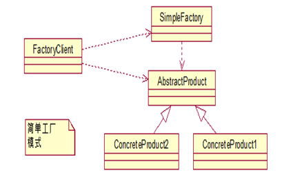
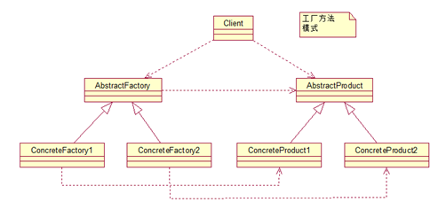
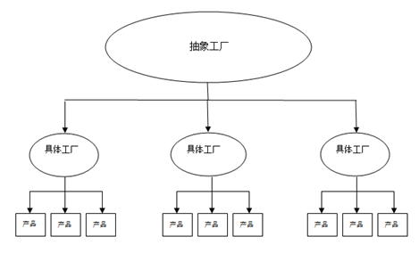
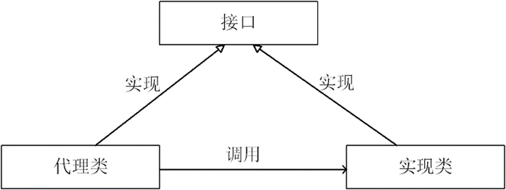

### 1. 什么是Java反射
1. 就是正在运行，动态获取这个类的所有信息。
### 2. 反射机制的作用
1. 反编译：.class-->.java
2. 通过反射机制访问java对象的属性，方法，构造方法等；
### 3.反射机制获取类有三种方法
1. Class.forName("类的完整路径")
   ```
        // 1.实例化对象 -- 无参构造函数
        // UserEntity userEntity = new UserEntity();
        // userEntity.userName = "猫头鹰";
        // System.out.println(userEntity.userName);
        // 2. 使用 Java 的反射机制创建对象  类的完整路径
        Class<?> forName = Class.forName("com.mao.entity.UserEntity");
        // 3. 使用反射机制创建对象
        UserEntity userEntity = (UserEntity) forName.newInstance();
        userEntity.userName = "反射对象";
        System.out.println(userEntity.userName);
        // 4. 反射的应用场景 jdbc连接、SpringIOC hibernate、mybatis
        // 5. 使用反射机制 获取类的信息
        Method[] methods = forName.getMethods();
        for (Method method : methods) {
            System.out.println(method.getName());
        }
        // 6. 获取类的属性
        Field[] fields = forName.getDeclaredFields();
        for (Field field : fields) {
            System.out.println(field.getName());
        }
   ```
   ### 4. 反射创建api
|方法名称|	作用
---|---
|getDeclaredMethods []|	获取该类的所有方法
|getReturnType()|	获取该类的返回值
|getParameterTypes()|	获取传入参数
|getDeclaredFields()	|获取该类的所有字段
|setAccessible	|允许访问私有成员

### 5.设计模式
1. 创建型模式，共五种：工厂方法模式、抽象工厂模式、单例模式、建造者模式、原型模式。
2. 结构型模式，共七种：适配器模式、装饰器模式、代理模式、外观模式、桥接模式、组合模式、享元模式。
3. 行为型模式，共十一种：策略模式、模板方法模式、观察者模式、迭代子模式、责任链模式、命令模式、备忘录模式、状态模式、访问者模式、中介者模式、解释器模式。

### 6. 单例设计模式
1. 什么是单例：
   保证一个类只有一个实例，并且提供一个访问该全局访问点
2. 单例优缺点
   1. 优点：
      1. 在单例模式中，活动的单例只有一个实例，对单例类的所有实例化得到的都是相同的一个实例。这样就 防止其它对象对自己的实例化，确保所有的对象都访问一个实例
      2. 单例模式具有一定的伸缩性，类自己来控制实例化进程，类就在改变实例化进程上有相应的伸缩性。
      3. 提供了对唯一实例的受控访问。
      4. 由于在系统内存中只存在一个对象，因此可以 节约系统资源，当 需要频繁创建和销毁的对象时单例模式无疑可以提高系统的性能。
      5. 允许可变数目的实例。
      6. 避免对共享资源的多重占用。
   2. 缺点：
      1. 不适用于变化的对象，如果同一类型的对象总是要在不同的用例场景发生变化，单例就会引起数据的错误，不能保存彼此的状态。
      2. 由于单利模式中没有抽象层，因此单例类的扩展有很大的困难。
      3. 单例类的职责过重，在一定程度上违背了“单一职责原则”。
      4. 滥用单例将带来一些负面问题，如为了节省资源将数据库连接池对象设计为的单例类，可能会导致共享连接池对象的程序过多而出现连接池溢出；如果实例化的对象长时间不被利用，系统会认为是垃圾而被回收，这将导致对象状态的丢失。

### 7. 单例创建方式
1.	饿汉式:类初始化时,会立即加载该对象，线程天生安全,调用效率高。
2.	懒汉式: 类初始化时,不会初始化该对象,真正需要使用的时候才会创建该对象,具备懒加载功能。
3.	静态内部方式:结合了懒汉式和饿汉式各自的优点，真正需要对象的时候才会加载，加载类是线程安全的。
4.	枚举单例: 使用枚举实现单例模式 优点:实现简单、调用效率高，枚举本身就是单例，由jvm从根本上提供保障!避免通过反射和反序列化的漏洞， 缺点没有延迟加载。
5.	双重检测锁方式 (因为JVM本质重排序的原因，可能会初始化多次，不推荐使用)
```java
/**
 * 饿汉模式
 */
public class User02 {
   // 类初始化的时候就会创建对象，天生线程安全，调用效率比较高，如果不适用对象的时候，就会浪费内存
   private static final User01 user01 = new User01();

   // 1. 将构造函数私有化
   private User01() {
   }

   public static User01 getInstance() {
      return user01;
   }

   //
   public static void main(String[] args) {
      User01 u1 = User01.getInstance();
      User01 u2 = User01.getInstance();
      System.out.println(u1 == u2);
   }
}
```
---
```java
/**
 * 懒汉式
 */
public class User02 {
    //懒汉式：类初始化时，不会创建该对象，正真需要时，才会加载（创建），天生线程不安全，需要解决线程安全问题，所以效率比较低。
    private static User02 user02;

    private User02() {
    }


    // 线程安全 效率低
    public static synchronized User02 getInstance() {
        if (user02 == null) {
            user02 = new User02();
        }
        return user02;
    }

    public static void main(String[] args) {
        User02 u1 = User02.getInstance();
        User02 u2 = User02.getInstance();
        System.out.println(u1 == u2);
    }
}
```
```java
/**
 * 静态内部类
 */
public class User03 {
    private User03() {
        System.out.println("初始化...");
    }

    public static class UserClassInstance {
        private static final User03 user03 = new User03();
    }

    public static User03 getInstance() {
        System.out.println("getInstance");
        return UserClassInstance.user03;
    }

    public static void main(String[] args) {
        User03 u1 = User03.getInstance();
        User03 u2 = User03.getInstance();
        System.out.println(u1 == u2);
    }
}
```
```java
/**
* 枚举单例
*/
public class User04 {
    private User04() {
    }

    public static User04 getInstance() {
        return SingletonUserEnum.INSTANCE.getInstance();
    }

    /**
     * 本身枚举就是单例的
     */
    static enum SingletonUserEnum {
        INSTANCE;
        private User04 user04;

        private SingletonUserEnum() {
            // 只会执行一次
            user04 = new User04();
        }

        public User04 getInstance() {
            return user04;
        }
    }

    public static void main(String[] args) {
        User04 u1 = User04.getInstance();
        User04 u2 = User04.getInstance();
        System.out.println(u1 == u2);
    }
}
```
---
### 8. 工厂模式
1. 什么是工厂模式: 实现了创建者和调用者分离，工厂模式分为简单工厂、工厂方法、抽象工厂模式
2. 工厂模式好处
   工厂模式是我们最常用的实例化对象模式了，是用工厂方法代替new操作的一种模式。
   利用工厂模式可以降低程序的耦合性，为后期的维护修改提供了很大的便利。
   将选择实现类、创建对象统一管理和控制。从而将调用者跟我们的实现类解耦。
3. 工厂模式分类
   1. 简单工厂模式: 简单工厂模式相当于是一个工厂中有各种产品，创建在一个类中，客户无需知道具体产品的名称，只需要知道产品类所对应的参数即可。但是工厂的职责过重，而且当类型过多时不利于系统的扩展维护。
### 9. 简单工厂模式
1. 简单工厂模式相当于是一个工厂中有各种产品，创建在一个类中，客户无需知道具体产品的名称，只需要知道产品类所对应的参数即可。但是工厂的职责过重，而且当类型过多时不利于系统的扩展维护。
   
2. 单工厂的优点/缺点
   1. 优点：简单工厂模式能够根据外界给定的信息，决定究竟应该创建哪个具体类的对象。明确区分了各自的职责和权力，有利于整个软件体系结构的优化。
   2. 缺点：很明显工厂类集中了所有实例的创建逻辑，容易违反GRASPR的高内聚的责任分配原则
```java
   public interface Car {
       void run();
   }
```
```java
/**
* 比亚迪汽车
  */
  public class BydCar implements Car {
  @Override
  public void run() {
  System.out.println("比亚迪汽车...");
  }
  }
```
```java
/**
 * 吉利汽车
 */
public class JiliCar implements Car {
    @Override
    public void run() {
        System.out.println("吉利汽车...");
    }
}
```
```java
/**
 * 汽车厂(4S店)
 */
public class CarFactory {
    public static Car createCar(String name) {
        if (StringUtils.isEmpty(name)) {
            return null;
        }
        if ("比亚迪".equals(name)) {
            return new BydCar();
        }
        if ("吉利".equals(name)) {
            return new JiliCar();
        }
        return null;
    }
}
```
```java
public class Client {
    public static void main(String[] args) {
        Car bydCar = CarFactory.createCar("比亚迪");
        Car jiliCar = CarFactory.createCar("吉利");
        bydCar.run();
        jiliCar.run();
    }
}
```

### 10. 工厂方法模式
1. 什么是工厂方法模式: 工厂方法模式Factory Method，又称多态性工厂模式。在工厂方法模式中，核心的工厂类不再负责所有的产品的创建，

```java
   public interface Car {
       void run();
   }
```
```java
/**
* 比亚迪汽车
  */
  public class BydCar implements Car {
  @Override
  public void run() {
  System.out.println("比亚迪汽车...");
  }
  }
```
```java
/**
 * 吉利汽车
 */
public class JiliCar implements Car {
    @Override
    public void run() {
        System.out.println("吉利汽车...");
    }
}
```
```java
/**
 * 汽车厂(4S店)
 */
public interface CarFactory {
    Car createCar(String name);
}
```
```java
/**
 * 比亚迪汽车4S店销售
 */
public class BydFactory implements CarFactory {
    @Override
    public Car createCar(String name) {
        return new BydCar();
    }
}
```
```java
/**
 * 吉利汽车4S店销售
 */
public class JiLiFactory implements CarFactory {
    @Override
    public Car createCar(String name) {
        return new JiliCar();
    }
}
```
```java
public class Client {
    public static void main(String[] args) {
        CarFactory carFactory = new BydFactory();
        Car car = carFactory.createCar("比亚迪");
        car.run();
        JiLiFactory jiLiFactory = new JiLiFactory();
        Car jiLiCar = jiLiFactory.createCar("吉利");
        jiLiCar.run();
    }
}
```
### 11. 抽象工厂模式
1. 什么是抽象工厂模式:
   抽象工厂简单地说是工厂的工厂，抽象工厂可以创建具体工厂，由具体工厂来产生具体产品。
   
   i[img.png](docs/imgs/abstractfactory2.png)

```java
/**
 * 发动机
 */
public interface Engine {
    void run();
    void start();
}

class EngineA implements Engine {

    @Override
    public void run() {
        System.out.println("发送机转速快...");
    }

    @Override
    public void start() {

    }
}

class EngineB implements Engine {
    @Override
    public void run() {
        System.out.println("发动机转速慢...");
    }

    @Override
    public void start() {

    }
}
```
```java
/**
 * 座椅
 */
public interface Chair {
    void run();
}

class ChairA implements Chair {
    @Override
    public void run() {
        System.out.println("自动加热...");
    }
}
class ChairB implements Chair {
    @Override
    public void run() {
        System.out.println("不能加热...");
    }
}
```
```java

/**
 * 包装厂
 */
public interface CarFactory {
    /**
     * 创建发动机
     *
     * @return 发动机
     */
    Engine createEngine();

    /**
     * 创建座椅
     *
     * @return 座椅
     */
    Chair createChair();
}

```
```java
public class JiLiFactory implements CarFactory{
    @Override
    public Engine createEngine() {
        return new EngineA();
    }

    @Override
    public Chair createChair() {
        return new ChairA();
    }
}

```
```java
public class Client {
    public static void main(String[] args) {
        CarFactory jiLiFactory = new JiLiFactory();
        Engine engineA = jiLiFactory.createEngine();
        Chair chairA = jiLiFactory.createChair();
        engineA.run();
        engineA.start();
        chairA.run();
    }
}
```
--- 
### 12. 代理模式
1.  什么是代理模式:
    通过代理控制对象的访问,可以详细访问某个对象的方法，在这个方法调用处理，或调用后处理。既(AOP微实现)  ,AOP核心技术面向切面编程。
    
2. 代理模式应用场景:
      SpringAOP、事物原理、日志打印、权限控制、远程调用、安全代理 可以隐蔽真实角色
3. 代理的分类:
   1. 静态代理(静态定义代理类)
   2. 动态代理(动态生成代理类)
   3. Jdk自带动态代理
   4. Cglib 、javaassist（字节码操作库）

**4. 静态代理**
   1. 什么是静态代理:
      由程序员创建或工具生成代理类的源码，再编译代理类。所谓静态也就是在程序运行前就已经存在代理类的字节码文件，代理类和委托类的关系在运行前就确定了。
```java
public interface IUserDao {
    void add();
}
```
```java
public class IUserDaoImpl implements IUserDao{
    @Override
    public void add() {
        System.out.println("add方法...");
    }
}
```
```java
public class UserDaoProxy implements IUserDao {
    private IUserDao iUserDao;

    public UserDaoProxy(IUserDao iUserDao) {
        this.iUserDao = iUserDao;
    }

    @Override
    public void add() {
        System.out.println("开启事务...");
        iUserDao.add();
        System.out.println("提交事务...");
    }
}
```
```java
/**
 * 静态代理，静态代理是需要生产代理对象的
 */
public class Demo01 {
    public static void main(String[] args) {
        IUserDao iUserDao = new IUserDaoImpl();
        UserDaoProxy userDaoProxy = new UserDaoProxy(iUserDao);
        userDaoProxy.add();
    }
}
```