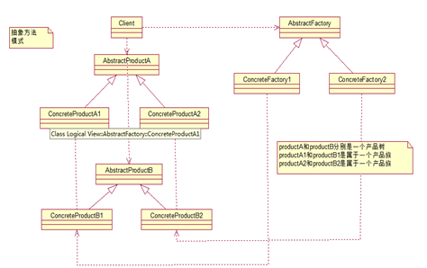

### 10. 工厂方法模式
1. 什么是工厂方法模式: 工厂方法模式Factory Method，又称多态性工厂模式。在工厂方法模式中，核心的工厂类不再负责所有的产品的创建，
   
```java
   public interface Car {
       void run();
   }
```
```java
/**
* 比亚迪汽车
  */
  public class BydCar implements Car {
  @Override
  public void run() {
  System.out.println("比亚迪汽车...");
  }
  }
```
```java
/**
 * 吉利汽车
 */
public class JiliCar implements Car {
    @Override
    public void run() {
        System.out.println("吉利汽车...");
    }
}
```
```java
/**
 * 汽车厂(4S店)
 */
public interface CarFactory {
    Car createCar(String name);
}
```
```java
/**
 * 比亚迪汽车4S店销售
 */
public class BydFactory implements CarFactory {
    @Override
    public Car createCar(String name) {
        return new BydCar();
    }
}
```
```java
/**
 * 吉利汽车4S店销售
 */
public class JiLiFactory implements CarFactory {
    @Override
    public Car createCar(String name) {
        return new JiliCar();
    }
}
```
```java
public class Client {
    public static void main(String[] args) {
        CarFactory carFactory = new BydFactory();
        Car car = carFactory.createCar("比亚迪");
        car.run();
        JiLiFactory jiLiFactory = new JiLiFactory();
        Car jiLiCar = jiLiFactory.createCar("吉利");
        jiLiCar.run();
    }
}
```
### 11. 抽象工厂模式
1. 什么是抽象工厂模式:
   抽象工厂简单地说是工厂的工厂，抽象工厂可以创建具体工厂，由具体工厂来产生具体产品。
   
   

```java
/**
 * 发动机
 */
public interface Engine {
    void run();
    void start();
}

class EngineA implements Engine {

    @Override
    public void run() {
        System.out.println("发送机转速快...");
    }

    @Override
    public void start() {

    }
}

class EngineB implements Engine {
    @Override
    public void run() {
        System.out.println("发动机转速慢...");
    }

    @Override
    public void start() {

    }
}
```
```java
/**
 * 座椅
 */
public interface Chair {
    void run();
}

class ChairA implements Chair {
    @Override
    public void run() {
        System.out.println("自动加热...");
    }
}
class ChairB implements Chair {
    @Override
    public void run() {
        System.out.println("不能加热...");
    }
}
```
```java

/**
 * 包装厂
 */
public interface CarFactory {
    /**
     * 创建发动机
     *
     * @return 发动机
     */
    Engine createEngine();

    /**
     * 创建座椅
     *
     * @return 座椅
     */
    Chair createChair();
}

```
```java
public class JiLiFactory implements CarFactory{
    @Override
    public Engine createEngine() {
        return new EngineA();
    }

    @Override
    public Chair createChair() {
        return new ChairA();
    }
}

```
```java
public class Client {
    public static void main(String[] args) {
        CarFactory jiLiFactory = new JiLiFactory();
        Engine engineA = jiLiFactory.createEngine();
        Chair chairA = jiLiFactory.createChair();
        engineA.run();
        engineA.start();
        chairA.run();
    }
}
```